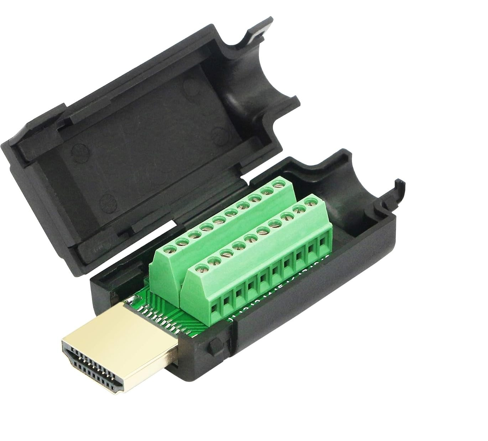

<!--
@file HARDWARE.md
@brief Hardware setup guide for OpenLux
@license GPL-3.0
@author OpenLux Contributors
-->

# Hardware Guide (ESP32 ↔ RS485 ↔ Luxpower)

> This project is independent and not endorsed by Luxpower/LuxpowerTek; trademarks belong to their owners.

## Bill of Materials
| Component         | Specification                       |
|-------------------|-------------------------------------|
| Microcontroller   | ESP32 (ESP32 / ESP32-S3 / ESP32-C3) |
| RS485 Transceiver | MAX485, SP485, or compatible        |
| Cabling           | Shielded twisted pair for RS485     |

## RS485 Wiring (text overview)
```
┌─────────────┐          ┌─────────────┐          ┌─────────────┐
│   ESP32     │          │  RS485      │          │  Luxpower   │
│             │          │  Module     │          │  Inverter   │
│         TX ─┼─────────>│ DI          │          │             │
│         RX ─┼<─────────│ RO          │          │             │
│     GPIO 4 ─┼─────────>│ DE/RE*      │          │             │
│             │          │             │          │             │
│        GND ─┼──────────┼─ GND        │          │             │
│             │          │          A ─┼─────────>│ RS485-A     │
│             │          │          B ─┼─────────>│ RS485-B     │
└─────────────┘          └─────────────┘          └─────────────┘
     (    )                   (3.3V/5V)                (Inverter)
```

> *DE/RE pin: if your RS485 module needs direction control, wire the pin defined by `RS485_DE_PIN`; if it is auto-direction, set `RS485_DE_PIN` to `-1`.


## Inverter RS485 ports (connection scenarios)
- Some inverters (e.g., SNA6000) expose RS485 on the CT port, so you can keep both the official dongle and OpenLux connected at the same time.<br/>
For inverters with RS485 on the CT port, see this wiring reference: https://github.com/nicolaERTT/ESP32-luxpower
- Other inverters (e.g., SNA-12K) expose RS485 only on the HDMI port used by the official dongle. In that case, unplug the official dongle and wire the HDMI pins as follows:

| HDMI Pin | Signal  | Notes                        |
|----------|---------|------------------------------|
| 18       | 5V      | Power RS485 module           |
| 16       | GND     | Common ground                |
| 15       | RS485A  | Differential A               |
| 14       | RS485B  | Differential B               |

     5V and GND can be connected directly to the ESP32 pins (no external PSU needed).


## Example hardware used

- RS-485 Module:


- HDMI Connector:



Non-affiliate links (AliExpress):
- https://it.aliexpress.com/item/1005010398547957.html
- https://it.aliexpress.com/item/1005005698921144.html

## Pin configuration
Edit in `src/config.h`:
```cpp
#define RS485_TX_PIN 17
#define RS485_RX_PIN 16
#define RS485_DE_PIN 4   // set to -1 if the RS485 module is auto-direction
```

## Ethernet (optional)
If your ESP32 board has Ethernet, set `OPENLUX_USE_ETHERNET` to `1` in `src/config.h` and adjust the PHY/pin parameters:
```cpp
#define OPENLUX_USE_ETHERNET 1
#define ETH_PHY_TYPE ETH_PHY_LAN8720   // or the PHY used by your board
#define ETH_PHY_ADDR 0
#define ETH_PHY_POWER_PIN -1
#define ETH_PHY_MDC_PIN 23
#define ETH_PHY_MDIO_PIN 18
#define ETH_PHY_CLK_MODE ETH_CLOCK_GPIO17_OUT // change if your clock is on GPIO0_IN, etc.
```
Adjust these values for your board (e.g., ESP32-Ethernet-Kit, custom LAN8720 modules).

## Notes on schematics
Provide a detailed schematic for:
- ESP32 ↔ RS485 module connection (including DE/RE).
- Connection to the inverter RS485 port (A/B, GND).
- RS485 module power (3.3V/5V per module spec).
- (Optional) Ethernet connections: RMII/MDC/MDIO/CLK/RESET pins specific to your board.

## Safety
- Use shielded cable for RS485 and, if recommended, tie the shield to GND on the inverter side.
- Avoid ground loops; share GND between ESP32 and RS485 transceiver.
- Verify voltage levels: most RS485 modules accept 5V, but the ESP32 is 3.3V.
