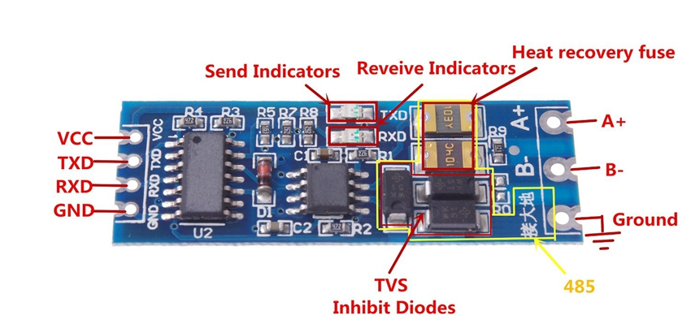
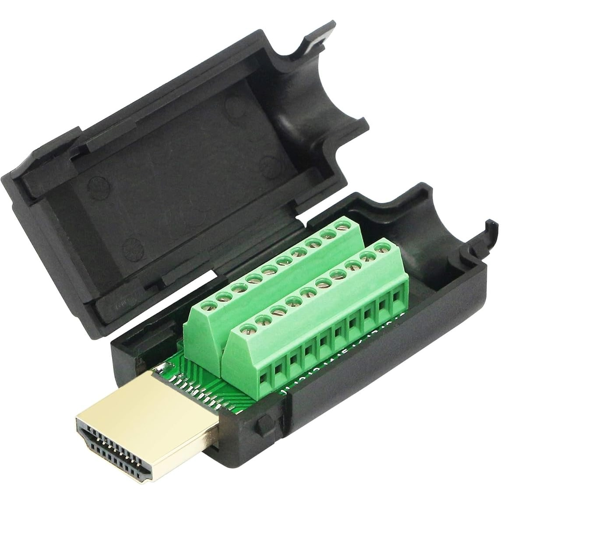
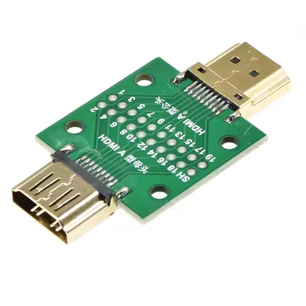
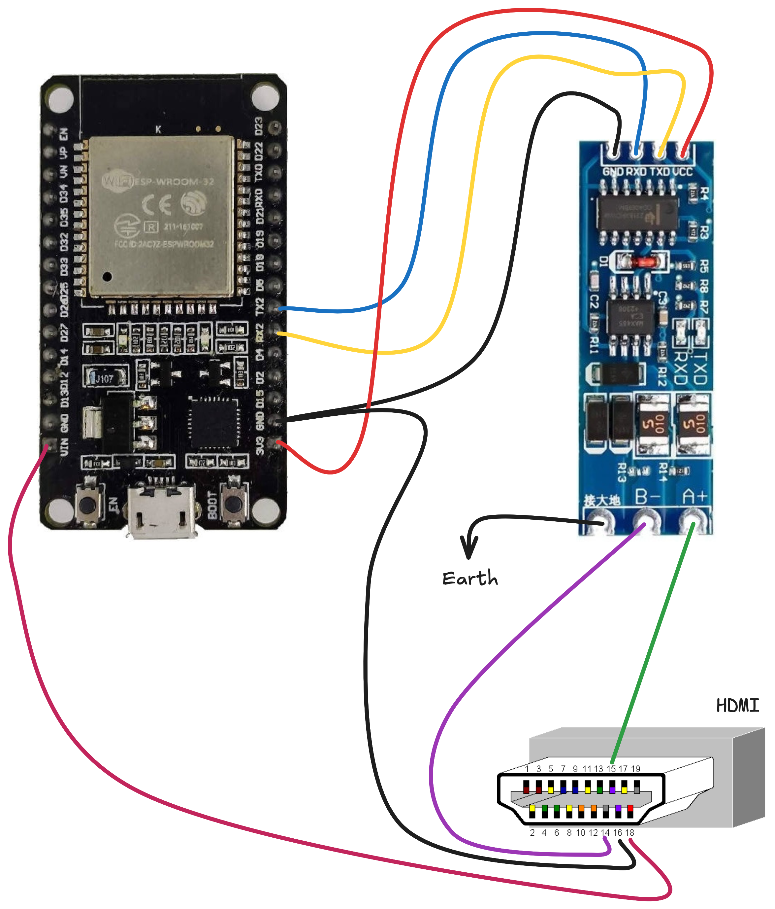
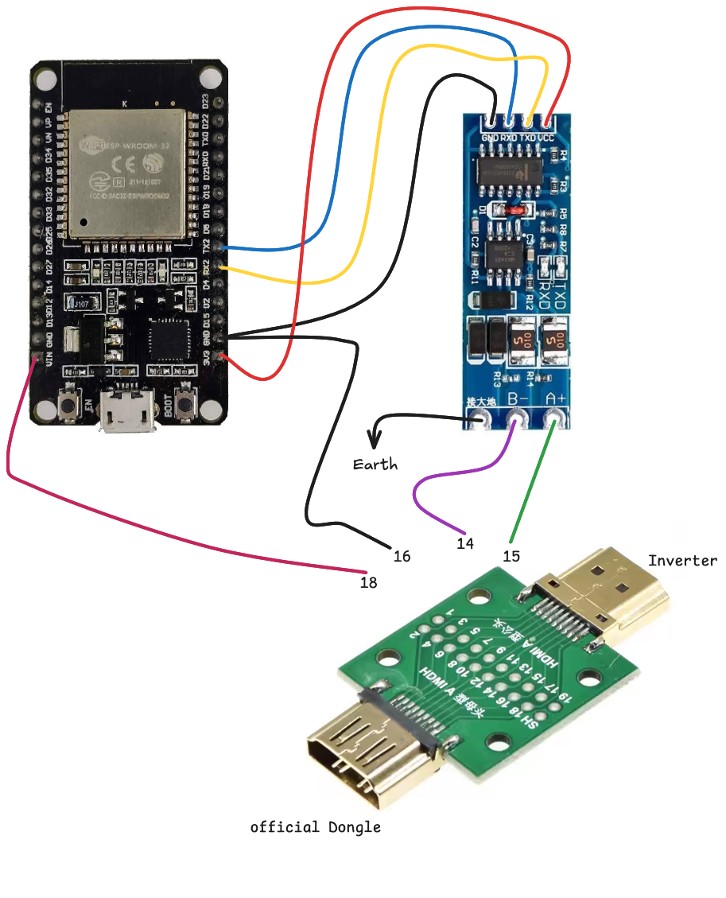

<!--
@file HARDWARE.md
@brief Hardware setup guide for OpenLux
@license GPL-3.0
@author OpenLux Contributors
-->

# Hardware Guide (ESP32 ↔ RS485 ↔ Solar Inverter)

> This project is independent and not endorsed by Luxpower/LuxpowerTek; trademarks belong to their owners.

## Bill of Materials
| Component         | Specification                       |
|-------------------|-------------------------------------|
| Microcontroller   | ESP32 (ESP32 / ESP32-S3 / ESP32-C3) |
| RS485 Transceiver | MAX485, SP485, or compatible        |
| Cabling           | Shielded twisted pair for RS485     |

## RS485 Wiring (text overview)
```
┌─────────────┐          ┌─────────────┐          ┌─────────────┐
│   ESP32     │          │  RS485      │          │  Luxpower   │
│             │          │  Module     │          │  Inverter   │
│         TX ─┼─────────>│ DI          │          │             │
│         RX ─┼<─────────│ RO          │          │             │
│      GPIO* ─┼─────────>│ DE/RE*      │          │             │
│             │          │             │          │             │
│        GND ─┼──────────┼─ GND        │          │             │
│             │          │          A ─┼─────────>│ RS485-A     │
│             │          │          B ─┼─────────>│ RS485-B     │
└─────────────┘          └─────────────┘          └─────────────┘
     (    )                   (3.3V/5V)                (Inverter)
```

> *DE/RE pin: if your RS485 module needs direction control, wire the GPIO defined by `RS485_DE_PIN`; if it is auto-direction or has no DE/RE input, set `RS485_DE_PIN` to `-1`.


## Inverter RS485 ports (connection scenarios)
- Some inverters (e.g., SNA6000) expose RS485 on the CT port, so OpenLux can be wired while the official dongle remains installed.<br/>
For inverters with RS485 on the CT port, see this wiring reference: https://github.com/nicolaERTT/ESP32-luxpower
- Other inverters (e.g., SNA-12K) expose RS485 only on the HDMI port used by the official dongle. In that case, unplug the official dongle and wire the HDMI pins as follows:

| HDMI Pin | Signal  | Notes                        |
|----------|---------|------------------------------|
| 18       | 5V      | Power RS485 module           |
| 16       | GND     | Common ground                |
| 15       | RS485A  | Differential A               |
| 14       | RS485B  | Differential B               |

Use the inverter 5V rail only if your ESP32 board/regulator and RS485 module are designed for it. Do not feed 5V into the ESP32 3V3 pin.


## Example hardware used

- RS-485 Module:



- HDMI Connector:



- HDMI Breakout Board for use with OpenLux alongside the official dongle (in this case, no HDMI connector is needed):




Non-affiliate links (AliExpress):
- https://it.aliexpress.com/item/1005010398547957.html
- https://it.aliexpress.com/item/1005005698921144.html
- https://it.aliexpress.com/item/1005004343592426.html



## Dual dongle mode (optional)


Dual dongle mode is experimental and depends on the physical RS485 bus. OpenLux can ignore unrelated valid frames and back off during contention, but software cannot fix a bus with missing termination, missing failsafe bias, bad A/B polarity, floating ground, or unstable transceiver direction control.

## Pin configuration
Edit in `src/config.h`:
```cpp
#define RS485_TX_PIN 17
#define RS485_RX_PIN 16
#define RS485_DE_PIN -1  // current default: auto-direction/no DE control
```

Common alternatives:
```cpp
#define RS485_DE_PIN 4   // example for modules that expose DE/RE direction control
```

Prefer explicit DE/RE control when comparing transceivers or debugging corrupted frames. Auto-direction modules can work, but their turn-around timing varies by board.

## Ethernet (optional)
If your ESP32 board has Ethernet, set `OPENLUX_USE_ETHERNET` to `1` in `src/config.h` and adjust the PHY/pin parameters:
```cpp
#define OPENLUX_USE_ETHERNET 1
#define ETH_PHY_TYPE ETH_PHY_LAN8720   // or the PHY used by your board
#define ETH_PHY_ADDR 0
#define ETH_PHY_POWER_PIN -1
#define ETH_PHY_MDC_PIN 23
#define ETH_PHY_MDIO_PIN 18
#define ETH_PHY_CLK_MODE ETH_CLOCK_GPIO17_OUT // change if your clock is on GPIO0_IN, etc.
```
Adjust these values for your board (e.g., ESP32-Ethernet-Kit, custom LAN8720 modules).

## Notes on schematics
Provide a detailed schematic for:
- ESP32 ↔ RS485 module connection (including DE/RE).
- Connection to the inverter RS485 port (A/B, GND).
- RS485 module power (3.3V/5V per module spec).
- (Optional) Ethernet connections: RMII/MDC/MDIO/CLK/RESET pins specific to your board.

## RS485 signal-quality checklist

If logs show CRC mismatches, invalid function codes, very long malformed frames, or repeated coexistence backoff events, check the physical bus before changing Home Assistant polling:

- Use a twisted pair for A/B and keep stubs short.
- Share GND between inverter, ESP32, and RS485 transceiver.
- Verify A/B polarity with the actual transceiver labels; vendors are not always consistent.
- Add or verify 120 ohm termination across RS485 A/B where appropriate for the cable topology.
- Ensure failsafe biasing so the bus has a stable idle state. The official dongle may have been providing useful bias/termination in some installations.
- Keep RS485 wiring away from inverter AC/DC power cables.
- Compare an auto-direction module with a transceiver using explicit DE/RE control if long frames are corrupted.
- Do not assume every "collision" log means a real second master; corrupted/noisy bytes can look like unrelated frames.

### RS485 A/B termination note

A resistor of about 120 ohm between RS485 A and B is the standard end-of-line
termination for a twisted-pair RS485 bus. On noisy or longer wiring, and
especially when OpenLux shares the inverter bus with the official dongle,
adding or verifying this termination at the correct bus end can reduce CRC
mismatches, malformed frames, timeouts, and client-visible communication
errors.

Do not add termination resistors at every device. RS485 normally expects
termination only at the physical ends of the bus; extra parallel terminators
lower the effective resistance and can overload or overheat weak transceivers.
Avoid low-value resistors such as 20 ohm between A and B. If communication gets
worse or the RS485 module heats up, power down and re-check wiring, polarity,
existing termination, and module health.

Termination is separate from failsafe biasing and grounding: a 120 ohm A/B
resistor damps signal reflections, while bias resistors define the idle state
and the common GND/shield strategy controls reference and noise paths.

## Safety
- Use shielded cable for RS485 and, if recommended, tie the shield to GND on the inverter side.
- Avoid ground loops; share GND between ESP32 and RS485 transceiver.
- Verify voltage levels: most RS485 modules accept 5V, but the ESP32 is 3.3V.
- Power down before rewiring inverter connectors or HDMI breakout boards.
